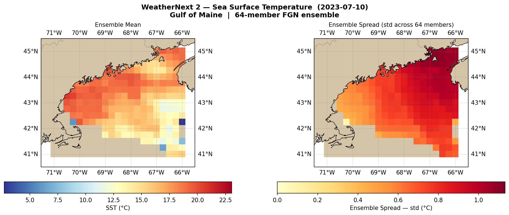
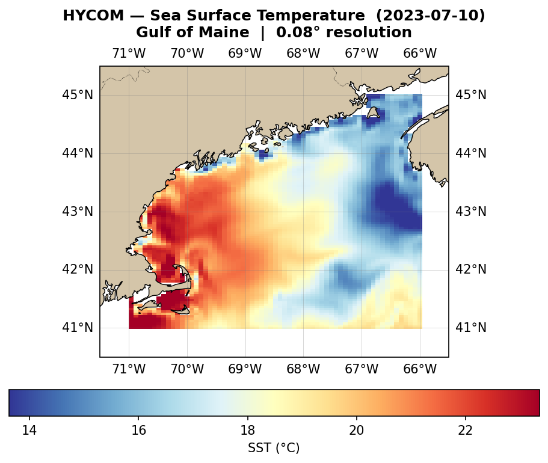
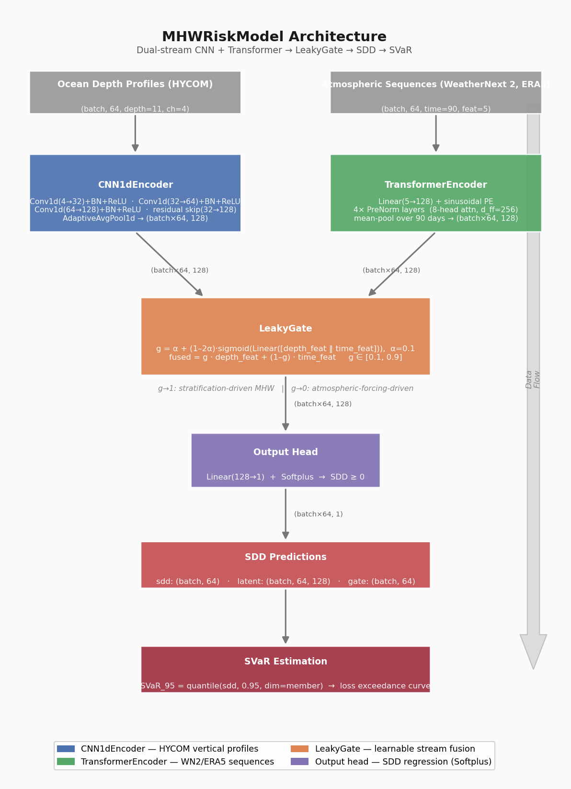
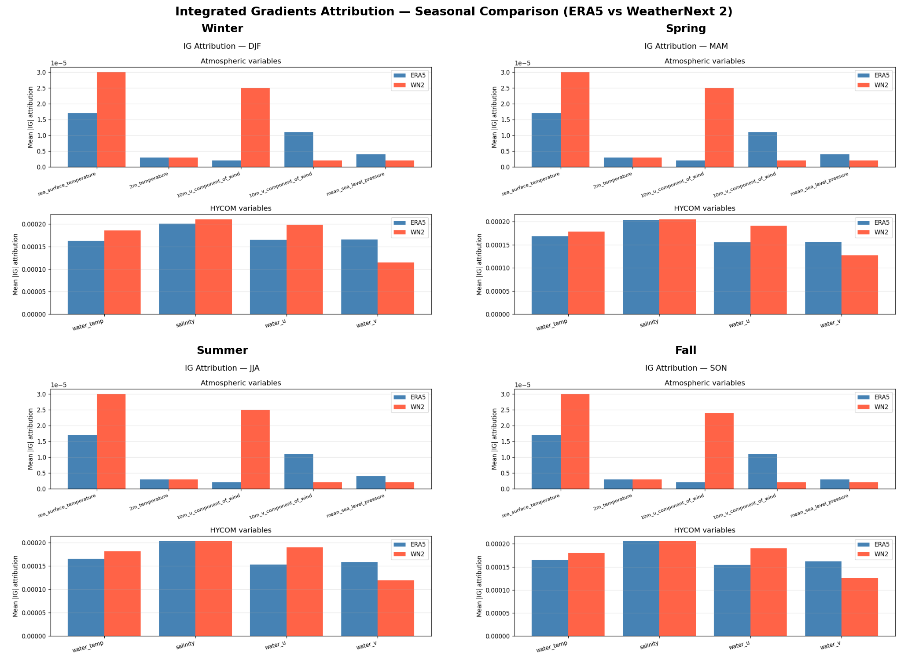

# mhw-risk-profiler

Harmonizes Google WeatherNext 2 (FGN-based ensemble) and HYCOM (Hybrid Coordinate Ocean Model)
data to calculate Spatial Value-at-Risk (SVaR) for aquaculture assets exposed to Marine Heatwave
(MHW) events. Designed as a production-ready, Dockerized pipeline bridging physical oceanography
and parametric financial risk.

---

## Project Logic: The SETS Framework

The SETS (Social-Ecological-Technological Systems) framework structures this project's design.
Each dimension is treated as a first-class engineering requirement, not an afterthought.

---

### Ecological — 3D Thermohaline Dynamics and MHW Biological Thresholds

Marine Heatwaves are not surface phenomena. Subsurface thermal anomalies dictate whether a
bleaching or mortality event propagates through the water column to affect aquaculture stock.

This pipeline ingests **HYCOM 3D thermohaline fields** (temperature, salinity, depth-resolved)
at 0.08-degree resolution alongside **WeatherNext 2 sea surface fields**, enabling detection of:

- **Salmon thresholds**: Prolonged exposure above 18-20 deg C triggers physiological stress,
  reduced feed conversion, and lice susceptibility. The pipeline accumulates thermal load as
  Stress Degree Days (SDD) against species-specific baselines.
- **Kelp thresholds**: Sea surface temperatures exceeding 18-21 deg C (species-dependent) cause
  canopy die-off and reproductive failure, collapsing the habitat scaffold for farmed species.
- **MHW categorization**: Follows Hobday et al. (2016, 2018) — events defined as SST anomaly
  exceeding the 90th percentile climatological threshold for 5+ consecutive days, classified
  Moderate (I) through Extreme (IV).

The ecological signal is the *physical input* to the financial risk layer.

---

### Social / Financial — Spatial Value-at-Risk (SVaR) and Parametric Insurance

The core financial output is **Spatial Value-at-Risk (SVaR)**: the worst expected loss (in
currency units) at a given confidence level (e.g., 95th or 99th percentile) across a defined
aquaculture lease polygon, derived directly from the ensemble distribution of MHW severity.

**The Derivative Insight**

Traditional aquaculture insurance relies on claims-based indemnity — slow, contested, and
lagged behind the biological event. This pipeline implements *parametric triggers*:

- A pre-agreed environmental index (SDD above a threshold) automatically triggers a payout
  without requiring proof of loss.
- The 64-member WeatherNext 2 ensemble provides a probabilistic SDD distribution at each
  grid cell, enabling actuaries to price the trigger objectively.
- SVaR translates ensemble spread directly into a loss exceedance curve, quantifying tail-risk
  in financial terms: "There is a 5% chance of losing X million USD of salmon biomass at this
  lease over the next 90 days."

This approach supports supply chain resilience by giving processors, lenders, and insurers a
forward-looking, spatially explicit risk signal, not a retrospective damage estimate.

---

### Technological — WeatherNext 2 FGN and the Science-to-Insight Pipeline

**Google WeatherNext 2** uses a Functional Generative Network (FGN) architecture — a
continuous, neural-operator approach to weather modeling that generates ensemble members as
draws from a learned distribution over atmospheric states, rather than perturbing initial
conditions as classical NWP does.

Key capability: the FGN architecture captures **non-Gaussian tail behavior** in ensemble
members. For MHW applications this matters because the worst heatwave events (Category III-IV)
are precisely the low-probability, high-consequence cases that classical Gaussian ensemble
spread underestimates.

**Science-to-Insight Pipeline**

```
WeatherNext 2 Zarr (GEE)                HYCOM NetCDF (THREDDS)
        |                                        |
        `-------------- harmonize.py ____________'
                              |
                    0.25-deg daily grid
                    CF-compliant xarray
                              |
                    1D-CNN + Transformer
                    (src/models/)
                    Vertical profile encoding
                              |
                    MHW detection + SDD
                    accumulation
                    (src/analytics/)
                              |
                    SVaR loss exceedance curve
                    per lease polygon
                              |
                    FastAPI endpoint
                    (parametric trigger output)
```

The 64 ensemble members from WeatherNext 2 are each processed independently through the
analytics layer, producing a 64-member SDD distribution. SVaR is estimated from the empirical
quantiles of this distribution, calibrated against historical HYCOM reanalysis.

---

## Visualizations

### Spatial Inputs: WeatherNext 2 SST

*Ensemble mean (left) and spread — std across 64 FGN members (right) for 2023-07-10, the highest-spread day in the GCS cache. Spread highlights regions where MHW outcomes diverge most across members, directly mapping to SVaR tail risk.*

### Spatial Inputs: HYCOM SST

*HYCOM 0.08° surface temperature for the same date — 3× finer resolution than WeatherNext 2. Gulf Stream warm-core filaments and shelf-break fronts are resolved in detail.*

### Model Architecture

*Dual-stream architecture: CNN1dEncoder encodes HYCOM vertical profiles (mixed layer depth, thermocline); TransformerEncoder encodes 90-day WN2/ERA5 atmospheric sequences. LeakyGate fuses both into per-member SDD predictions used for SVaR estimation.*

### XAI: Integrated Gradients Attribution (ERA5 vs WeatherNext 2)

*Seasonal attribution maps showing which input features drive SDD predictions. ERA5 (blue) vs WeatherNext 2 (red) reveals how non-Gaussian ensemble spread shifts feature importance across atmospheric and ocean variables.*

---

## Repository Architecture

See `mhw-repo-architecture.md` for the annotated directory tree.

---

## Quickstart

```bash
# Build the Docker environment
docker build -t mhw-risk-profiler .

# Run the GEE ingestion pipeline
docker run --env-file .env mhw-risk-profiler

# Override entrypoint for analytics
docker run --env-file .env mhw-risk-profiler python -m src.analytics.var_engine
```

---

## Data Sources

| Source | Format | Access | Resolution | Role |
|---|---|---|---|---|
| Google WeatherNext 2 | Zarr | GEE Python API | ~0.25 deg, daily | Atmospheric ensemble, SST tail-risk |
| HYCOM | NetCDF | THREDDS / direct download | 0.08 deg, daily | 3D thermohaline, subsurface profiles |

Harmonization target: daily, 0.25-degree global grid, aligned time axis, CF-compliant NetCDF/Zarr.

---

## Research Inputs

Background literature synthesis and hypothesis framing are in `mhw_ai_research/` (git-ignored).
See Gemini and Perplexity deep-dives for the scientific basis of threshold choices and model selection.
